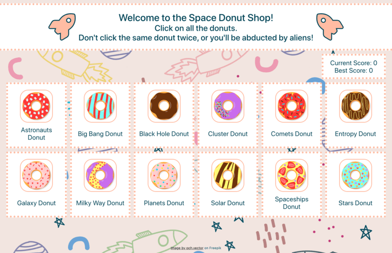

# Space Donuts

## Introduction

This project is a browser memory game in which the user's goal is to never click the same card twice. It is a front-end app built with React.

The project primarily demonstrates use of state, effect, and ref hooks to create a React app using only functional components.

## Preview

Run this project [here](https://xsherryhe.github.io/memory-card-game/).

## Image Credits

1. Colorful glazed donuts - pch.vector on Freepik  
https://www.freepik.com/free-vector/colorful-glazed-donuts-flat-illustrations-set_19212757.htm#query=cartoon%20donut

2. Space Galaxy GIF - doodles on GIPHY  
https://giphy.com/gifs/doodles-doodle-doodles-nft-TvMVORj5GsjreUpfxX

3. Donut GIF - 100% Soft on GIPHY  
https://giphy.com/gifs/space-donuts-donut-l0Iy47Iotb2nSvz7W

4. space-astronomy-spaceships - 18706286 on Pixabay
https://pixabay.com/vectors/space-astronomy-spaceships-5654794/
